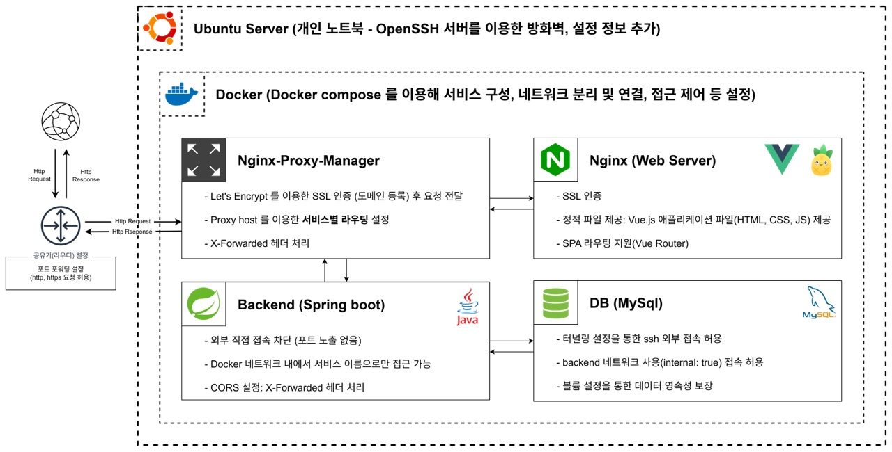

## 포트폴리오를 배포중인 개인 서버 아키텍처

## 포트폴리오 바로가기 → [http://www.hoonee-math.info](http://www.hoonee-math.info/portfolio/)

해당 프로젝트는 온프레미스 환경의 개인 서버를 이용해 배포하고 있습니다.

[ 최초 접속시 접속이 원할하지 않을 수 있습니다. ]

## 서버 운영 환경

- 운영체제 : Linux Ubuntu 24.04 Lts
- 프로세서 : Intel core i3
- RAM : 4GB
- OpenSSH 서버
- 포트포워딩 설정을 통한 와이파이 접속

